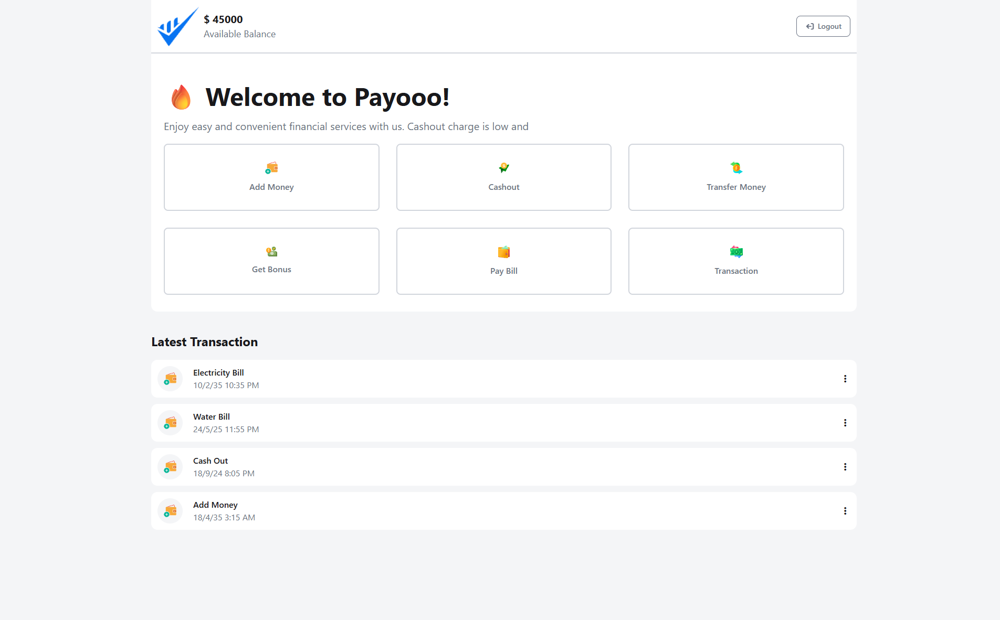
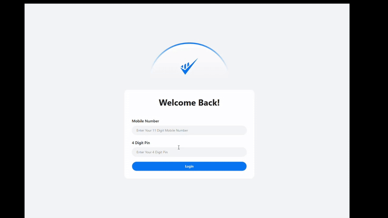

# Payoo - Simple Mobile Payment App

[🌐 Live Demo](https://your-github-username.github.io/Payoo-simple-mobile-app/)  

 

---

## Overview
**Payoo** is a simple mobile payment application designed to provide users with a clean and intuitive interface for managing digital payments. This project focuses on **frontend development**, offering a responsive and modern UI experience.

---

## Features 
- **Login** pages (UI only)  
- **Payment Section** (UI only)  
- Fully **Responsive Design** using Tailwind CSS  

---

## Tech Stack
- **HTML** – Structure and content  
- **Tailwind CSS** – Styling and responsive UI  
- **JavaScript** – Basic interactivity and dynamic content  

---

## Screenshots / Preview
 
#### Login Page
  

#### Home Page
  

#### GIF Preview
  

---

## Installation
1. Clone the repository:
```bash
git clone https://github.com/obaidullah-miazi-dev/Payoo-simple-mobile-app.git
```
2. Navigate to the project directory:
```bash
cd Payoo-simple-mobile-app
```
3. Open `index.html` in a browser or use **Live Server** for development.

---

## Project Structure
```
Payoo-simple-mobile-app/
│
├─ index.html
├─ style.css (Tailwind CSS)
├─ script.js
└─ assets/ (Images, icons, GIFs)
```

---

## Contributing
1. Fork the repository  
2. Create a new feature branch (`git checkout -b feature-name`)  
3. Commit your changes (`git commit -m 'Add some feature'`)  
4. Push to the branch (`git push origin feature-name`)  
5. Open a Pull Request  

---

## License
This project is licensed under the **MIT License**.

Contact

GitHub: https://github.com/obaidullah-miazi-dev  

LinkedIn: http://www.linkedin.com/in/obaidullah-miazi  

Email: obaidullahmiazi.dev@gmail.com
